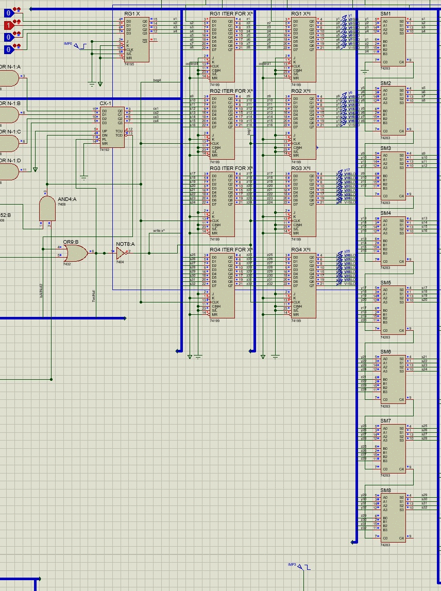
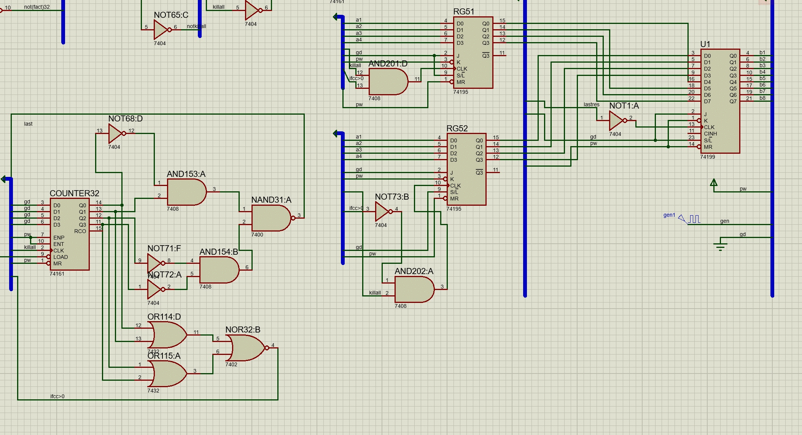

____
Для начала поясним идею реализации. Главная идея заключается в разложении exp(x) в ряд Тейлора. Ряд имеет следующий вид:
```
exp(x) = 1 + x + (x^2/2!) + (x^3/3!) + ...
```
После разложения немного подумаем над разрядностью, точнее какое количество бит придется хранить. Если посмотреть внимательно, то видно, что уже exp(10)  = 22 026.46. Если представлять это в двоичной записи, то нам понадобится 15 бит, а если рассмотреть exp(15) = 3269017.32 - 22 бита, тогда Х будем брать 4 бита, однако тогда для 15^15 понадобится слишком много разрядностей, что очень тяжело будет реализовать, после подсчетов было выбрано считать максимум exp(9), для этого нам необходимо 32 разряда для хранение 9^9(поясню почему мы именно обращаем внимание на 9^9, так как до этого момента дробь x^i/i! точно не будет уменьшаться, то есть точно полезная для нас нагрузка, далее возможно дробь уже будет потихоньку стремиться к 0)

## Разбор схемы
____
Рассмотрим схему слева на право, в самом левом крае схемы видно массив регистров с именованием *RG1 x^i* , *RG2 x^i* , *RG3 x^i* , *RG4 x^i*, которые хранят значение для x в степени i, все реализуется следующим образом:
1) записывается в регистр x^i и устанавливается в счетчик также x через регистр (*RG1 X*)
2) счетчик (*CX-1*) начинает постепенно вычитать из х единицу
3) на каждую итерацию счетчика сумматоры(*SM1*, *SM2*, *SM3*, *SM4*, *SM5*, *SM6*, *SM7*, *SM8*) складывают значения в *RG1 ITER FOR x^i* , *RG2 ITER FOR x^i* , *RG3 ITER FOR x^i* , *RG4 ITER FOR x^i*
4) тем самым к концу мы получаем значение в регистрах x^(i+1)

пример подсчетов в виде gif для x=2 (так очень просто увидеть, что все считает)



Рассмотрим схему ниже, которая считает факториалы.
Аналогичным образом в регистрах *FACT1*, *FACT2*, *FACT3*, *FACT4* хранится значение факториала, так как факториал можно представить рекуррентно``` n! = (n-1)! * n```, то исходя из этого наш алгоритм действует следующим образом
1) в данной схеме присутствуют два счетчика *N1* and *N2* которые считают i на каждом шаге
2) далее i записывается в счетчик *CF1* and *CF2*
3) после этого выполняется i раз суммирование прошлого накопленного факториала на сумматорах (*SM9*, *SM10*, *SM11*, *SM12*, *SM13*, *SM14*, *SM15*, *SM16*
4) промежуточные значения хранятся в регистрах  *PREF1*, *PREF2*, *PREF3*, *PREF4*

пример работы представлен в виде gif ниже


Далее правее этих двух частей было реализовано деление, причем с самого начала мы пытались реализовать синхронный подсчет этих двух частей (факториала и деления), однако из-за этого деление не всегда получается правильно, синхронизация прошла успешно, ответ неправильный)))

Деление реализовано с помощью следующей схемы:
1) сравниваем x^i и i! (*COM31*, *COM32*,*COM33*, *COM34*, *COM35*, *COM36*, *COM37*, *COM38*, *COM39*)
2) если x^i < i переходим на шаг 6
3) вычитаем из x^i  -  i! (для этого надо найти код дополнение i! для этого необходимо проинвертировать побитно i! это делаю *NOT31*, *NOT32*, *NOT33*, *NOT34*, *NOT35* ... *NOT62* далее на сумматорах с 41 по 48 происходит вычитание)
4) счетчик прибавляет +1 (*COUNTER31*, *U2*, *U3*, *U4*, *U5*, *U6*, *U7*, *U8*)
5) переходим на шаг 1)
6) передаем остаток в следующую схему (*U48*, *U49*, *U50*, *U51*)

Аналогичным образом реализован подсчет остатков до двух знаков после запятой(остальная схема) так как он реализуется уже после деления
P.S. Важное замечание, для получение остатков сам начальный остаток необходимо умножить на двоичное 1010, что реализуется на сумматорах с 31 по 39, остальная часть схемы устроена аналогичным образом как и представленное выше описание.

P.S. После получения на регистр остатков можно увидеть следующие компоненты


Они необходимо для определения какой остаток брать самый первый или второй получившийся после получения первого знака после запятой

пример подсчета остатков на значениях остаток 5 - 101, делитель 6 - 110, в результате должно быть что-то типо 1000(8) - первое число и 0011(3) - второе



так и получилось

## Подведение итогов
___
Можно сказать, что по отдельности все реализовать получилось, однако единственное, что не получилось так это реализовать синхронизацию, мы хотели сделать все более менее правильно и во время, однако они нас не хотели